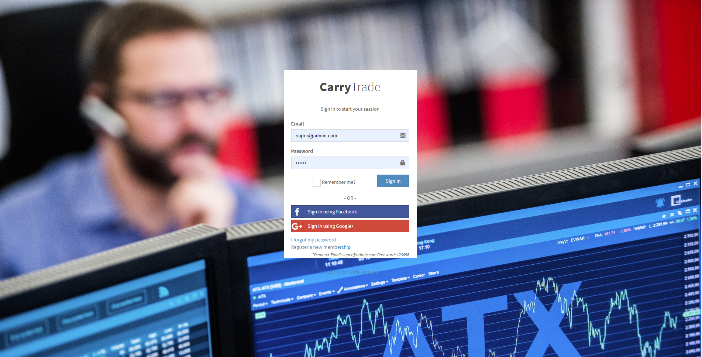
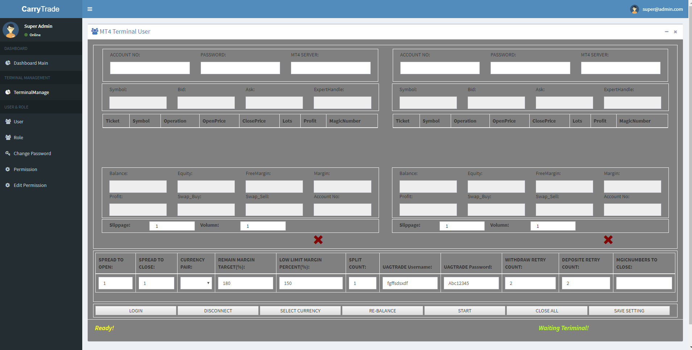
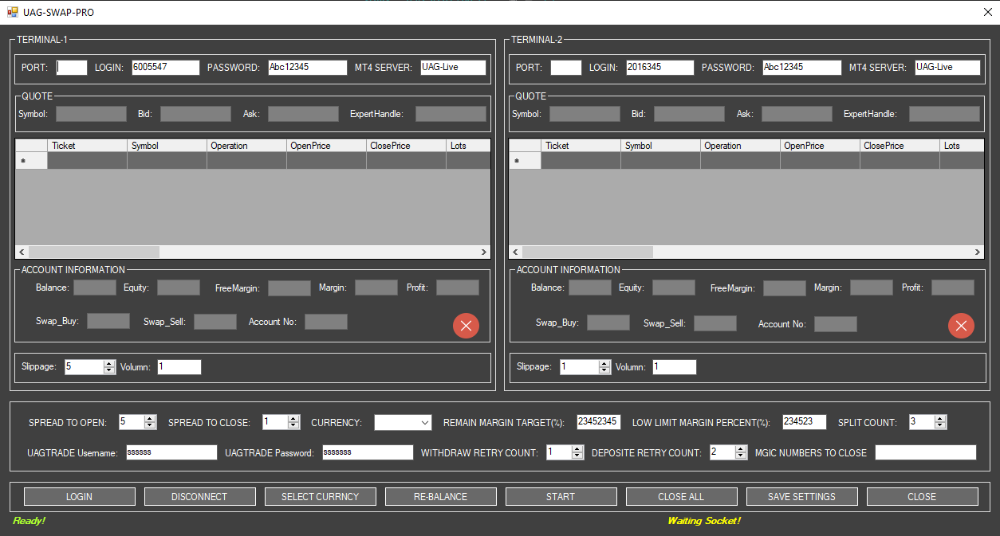
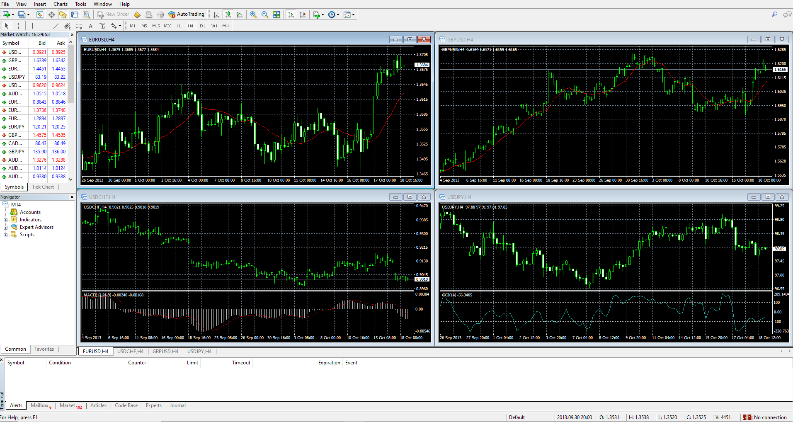

# MT4-Metatrader-CarryTrading
[![NPM Version][npm-image]][npm-url]
[![Build Status][travis-image]][travis-url]
[![Downloads Stats][npm-downloads]][npm-url]
> The carry trade is one of the most popular trading strategies in the currency market. Mechanically, putting on a carry trade involves nothing more than buying a high yielding currency and funding it with a low yielding currency, similar to the adage "buy low, sell high."

> The most popular carry trades involve buying currency pairs like the Australian dollar/Japanese yen and New Zealand dollar/Japanese yen because the interest rate spreads of these currency pairs are very high. The first step in putting together a carry trade is to find out which currency offers a high yield and which one offers a low yield.

## My Project is constructed with 3 part.
1. Expert Advisor of MT4 -> EX4
2. MTApi Controller -> CarryTraderTerminal
3. CarryTrading Management System -> CarryTraderManager
## CarryTrader Manager Interfaces


## CarryTrader Terminal Manager Interface

## Broker EA


## Installation

OS X & Linux:

```sh
dotnet run
npm start
```

Windows:

```sh
dotnet run
npm start
```

## Usage example

In this project.
The CarryTradeManger will manage clients who want to use this strategy.
And SocketManager will keep the communication between Manager and Terminal Manager.
So You have to install this CarryTradeManager and SocketManager to WebHost.

## Development setup
1. Visual Studio 2017 (ASP.NET.CORE, C#)
2. NodeJS

```sh
npm install
```

## Release History

* 1.0.0
    * Complete Total!
* 0.9.0
    * Complete: CarryTradeManager Finish.
* 0.6.0
    * Complete: EA Finish.
* 0.3.0
    * Complete: TerminalManagement Finish.
* 0.0.1
    * Work in progress

## Meta

Your Name – [@YourTwitter](https://twitter.com/dbader_org) – YourEmail@example.com

Distributed under the XYZ license. See ``LICENSE`` for more information.

[https://github.com/yourname/github-link](https://github.com/dbader/)

## Contributing

1. Fork it (<https://github.com/yourname/yourproject/fork>)
2. Create your feature branch (`git checkout -b feature/fooBar`)
3. Commit your changes (`git commit -am 'Add some fooBar'`)
4. Push to the branch (`git push origin feature/fooBar`)
5. Create a new Pull Request

<!-- Markdown link & img dfn's -->
[npm-image]: https://img.shields.io/npm/v/datadog-metrics.svg?style=flat-square
[npm-url]: https://npmjs.org/package/datadog-metrics
[npm-downloads]: https://img.shields.io/npm/dm/datadog-metrics.svg?style=flat-square
[travis-image]: https://img.shields.io/travis/dbader/node-datadog-metrics/master.svg?style=flat-square
[travis-url]: https://travis-ci.org/dbader/node-datadog-metrics
[wiki]: https://github.com/yourname/yourproject/wiki
